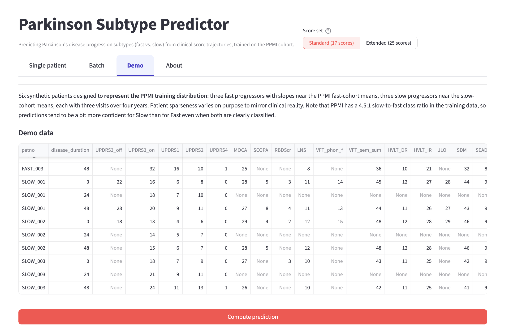
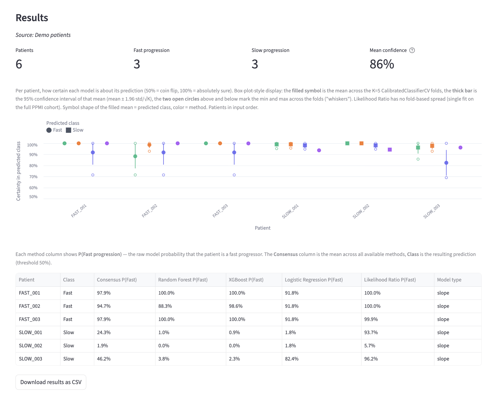
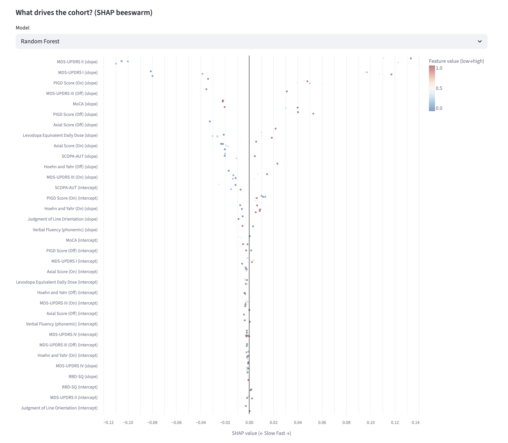
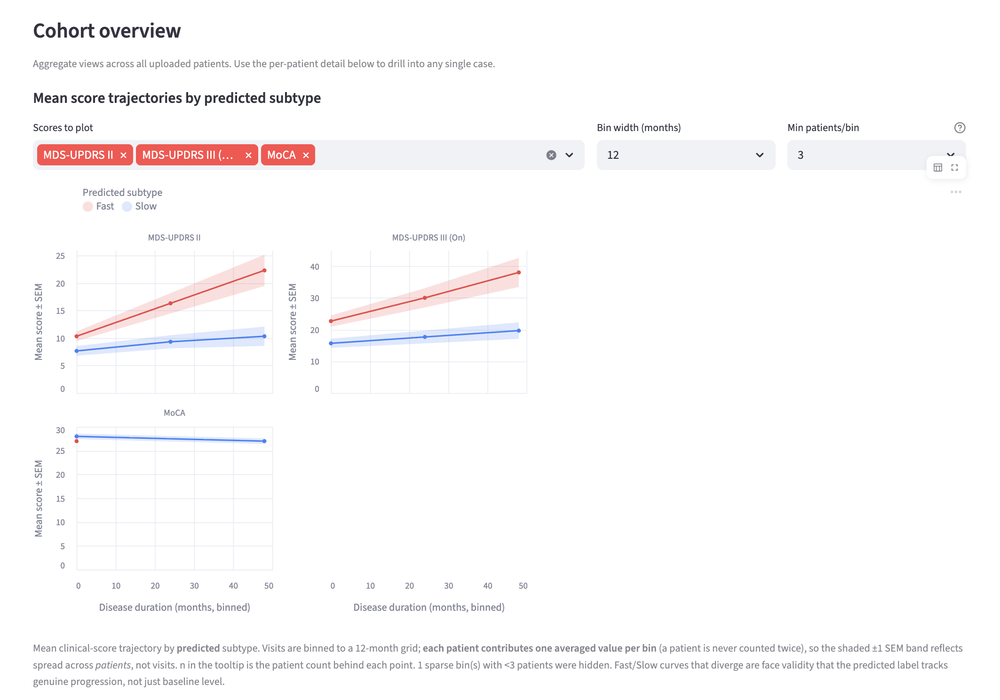

# Parkinson Subtype Predictor

[](https://github.com/cl-poehl/parkinson-subtype-predictor/actions/workflows/ci.yml)
[](LICENSE)

[](https://streamlit.io)

A calibrated, abstaining web application that recovers a Parkinson's disease
**progression subtype** (fast vs. slow) from the routine clinical scores already
in a movement-disorders chart — no imaging, digital sensors, genetics, or a
population-level latent-time model required.

The scientific point is **deployability, not raw accuracy**: it takes an
established, cross-cohort research subtype (defined by an LTJMM + VaDER pipeline
on multimodal longitudinal data) and makes it usable at the bedside, with honest
uncertainty — the model **defers to the clinician** when it cannot yet decide.

> **Status.** Research and demonstration tool accompanying a manuscript in
> preparation. Predictions are **not clinically validated** and do not replace
> medical judgement.

**Live demo:** [parkinson-subtype-predictor.onrender.com](https://parkinson-subtype-predictor.onrender.com)
(free tier — the first load after idle can take a minute to wake up)

---

## Screenshots

_All screenshots use the built-in synthetic demo cohort (no real patient data)._

Single-patient and cohort prediction, with a selectable routine (17) or extended
(25) score set:



Predictions per method with calibrated probabilities and a per-patient
confidence display:



What drives the predictions across a cohort (SHAP):



Mean score trajectories by predicted subtype — face validity that the predicted
label tracks real progression, not just baseline level:



## What it does

- **Predicts the subtype** from ordinary-least-squares slopes and intercepts of
  routine clinical scores (MDS-UPDRS I–IV, MoCA, SCOPA-AUT, RBD, Hoehn–Yahr,
  PIGD, axial and fluency measures, LEDD).
- **Quantifies uncertainty two ways.** A calibrated per-patient probability
  interval (Venn-Abers) says *how sure*; a split-conformal prediction set (90%
  coverage) says *which label — or `{Fast, Slow}` when it should abstain*.
- **Handles missing data.** kNN imputation covers a single missing core score;
  when two or more MDS-UPDRS core parts are absent, the app routes to a fallback
  model trained natively on the scores that are present.
- **Explains every prediction** with SHAP attributions, per-score percentile
  position against the reference cohort, and single-feature counterfactuals.
- **Single patient and cohort (CSV) modes**, with subtype-stratified trajectory,
  SHAP, decisiveness and data-quality summaries across an uploaded cohort.

## How it works

1. **Features** — per patient, per score: the slope and intercept of an OLS fit
   over disease duration (`feature_extraction.py`, `src/features.py`).
2. **Calibration** — `CalibratedClassifierCV` (isotonic) so the probabilities
   mean what they say (`src/`).
3. **Uncertainty** — Venn-Abers probability intervals (`src/vennabers.py`) and
   MAPIE split-conformal prediction sets with abstention (`src/conformal.py`),
   both distribution-free and fit on the same calibration split.
4. **Missing-core routing** — `core_presence_route()` in `src/constants.py`
   selects the primary model or a native fallback (`views/_utils.py`).

## Repository layout

```
app.py                 Streamlit entry point
constants.py           score labels, subtype definitions, paths
data_loading.py        cohort loading + disease-duration derivation
feature_extraction.py  slope/intercept feature construction
ml_models.py           model training + cross-validation
likelihood.py          likelihood-ratio reference method
src/                   library: calibration, conformal, venn-abers, inference,
                       SHAP, survival, counterfactuals, clinical metrics
views/                 UI: single-patient, batch, demo, about
scripts/               reproducibility: training, evaluation, figures
tests/                 unit tests (routing, conformal, venn-abers, features)
data/demo_patients.csv synthetic example patients (safe to share)
```

## Running it locally

```bash
pip install -r requirements.txt
streamlit run app.py
```

The trained models are **not included** in this repository (see below), so a
fresh clone can display the interface but cannot produce predictions until the
models are present. For a working tool, use the live demo, or regenerate the
models from PPMI data as described next.

## Reproducing the analysis

The pipeline is fully scripted. With access to the source data (below) placed in
`data/`, the models and all analysis outputs regenerate from scratch:

```bash
python scripts/train_models.py            # primary models
python scripts/train_fallback_models.py   # missing-core fallback library
python scripts/train_vennabers.py         # Venn-Abers calibrators
# ... plus per-analysis scripts (survival_analysis.py, score_set_comparison.py, ...)
```

## Data availability

This work uses data from the **Parkinson's Progression Markers Initiative
(PPMI)**. PPMI data are governed by a **Data Use Agreement** and are **not
redistributed here** — neither the raw data nor participant-level derived files
(including trained models, whose imputer retains training feature vectors).
Obtain the data directly from [ppmi-info.org](https://www.ppmi-info.org/) and
place the required files in `data/`; the scripts then reproduce everything.

The subtype labels are those of Hähnel et al. (2024), derived by LTJMM + VaDER on
the PPMI, ICEBERG and LuxPARK cohorts.

## Citation

Manuscript in preparation. Please check back for the citation, or contact the
author.

## License

[MIT](LICENSE) © 2026 Carl Poehl.

## Acknowledgements

Data used in the preparation of this article were obtained from the Parkinson's
Progression Markers Initiative (PPMI) database. Subtype definitions follow
Hähnel T. et al., *Progression subtypes in Parkinson's disease identified by a
data-driven multi-cohort analysis*, npj Parkinson's Disease (2024).
